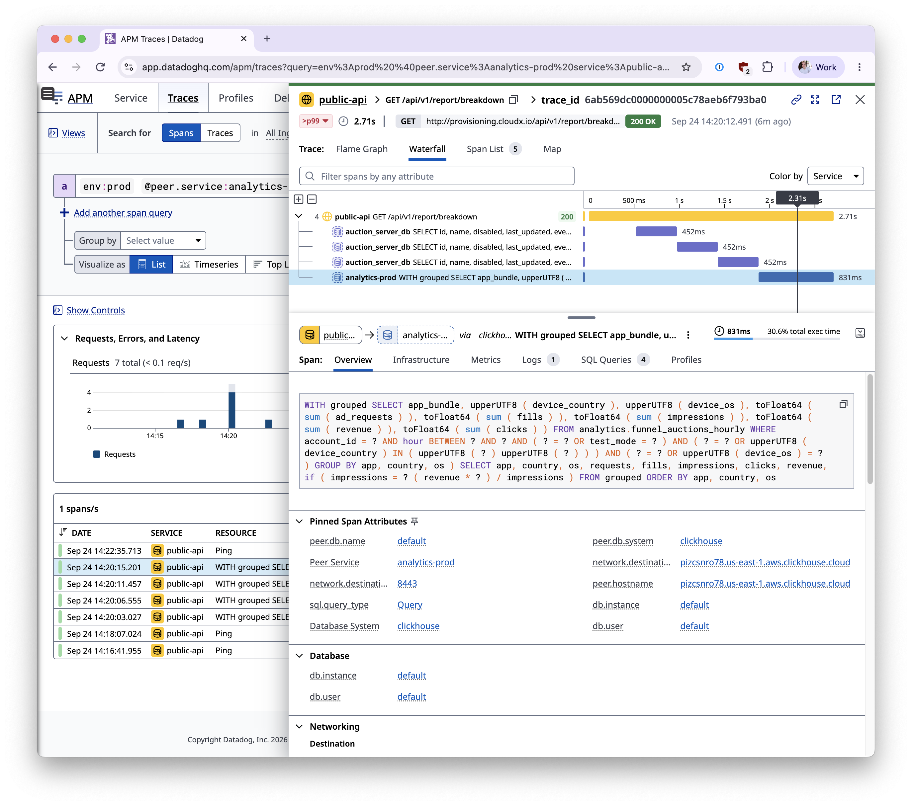

# dd-trace-clickhouse-go

Datadog tracing for the [ClickHouse Go driver's](https://github.com/ClickHouse/clickhouse-go) native `clickhouse.Conn` API.

`dd-trace-clickhouse-go` lets you wrap a connection once, then use it as usual.

All calls made over either the native or HTTP transport generate Datadog client spans.

This package is an intentionally small, standalone implementation of the [proposal to add native ClickHouse tracing to dd-trace-go](https://github.com/DataDog/dd-trace-go/discussions/5332).

Use this package to get very nice Datadog monitoring of your Clickhouse queries and make them more easily debuggable and interpretable in the Datadog APM dashboards:


<p align="center"><i>Datadog APM trace with an automatic span for a Clickhouse query</i></p>

## Install

```sh
go get github.com/cloudx-io/dd-trace-clickhouse-go@latest
```

This module requires Go 1.27 or newer. The install command also adds the ClickHouse Go driver and the Datadog Go tracer as dependencies.

Go Package Documentation: [https://pkg.go.dev/github.com/cloudx-io/dd-trace-clickhouse-go](https://pkg.go.dev/github.com/cloudx-io/dd-trace-clickhouse-go)

## Quickstart

Open a ClickHouse connection, wrap it once, and pass request contexts to the wrapped connection.

If you want to make a driver's span the child of an active request, pass the current request context. If no context is passed in, all calls to clickhouse driver will produce a root span.

```go
package main

import (
    "context"
    "log"

    "github.com/ClickHouse/clickhouse-go/v2"
    "github.com/DataDog/dd-trace-go/v2/ddtrace/tracer"
    ddtrace "github.com/cloudx-io/dd-trace-clickhouse-go"
)

func main() {
    if err := run(context.Background()); err != nil {
        log.Fatal(err)
    }
}

func run(ctx context.Context) error {
    tracer.Start()
    defer tracer.Stop()

    conn, err := clickhouse.Open(&clickhouse.Options{
        Addr: []string{"localhost:9000"},
    })
    if err != nil {
        return err
    }


    // Wrap the connection with `ddtrace` from dd-trace-clickhouse-go

    conn = ddtrace.Wrap(conn, ddtrace.WithPeerService("analytics"))
    defer conn.Close()


    // QueryRow() produces a trace, but not the later Scan()
    //
    // Your code still receives errors on .Scan() but QueryRow() will not record them

    var version string
    return conn.QueryRow(ctx, "SELECT version()").Scan(&version)
}
```


## How it works

In general, the implementation is designed to mirror the behavior of the upstream implementation [of contrib/database/sql](https://github.com/DataDog/dd-trace-go/tree/main/contrib/database/sql).

`ddtrace.Wrap()` re-uses an existing connection, then each traced call produces a `clickhouse.query` span:

```
span.kind=client

db.system=clickhouse

component=ClickHouse/clickhouse-go.v2

sql.query_type
```


**Errors**

The wrapper returns driver errors unchanged. By default, a returned error marks its span as an error. `WithErrorCheck` can exclude expected errors from that span.


**Driver Calls & Recorded Spans**

A span covers the driver method call and ends when it returns. The resource is the SQL query text, or `Ping` for a ping. 


| Driver call | `sql.query_type` | What the span measures |
| --- | --- | --- |
| `Select` | `Query` | The call, including decoding into the destination |
| `Query`, `QueryRow`, `QueryFormat` | `Query` | Opening the rows, row, or reader; later reads and scans are outside the span |
| `Exec`, `AsyncInsert`, `InsertFormat` | `Exec` | The driver call; `AsyncInsert` with `wait=false` does not wait for insertion |
| `PrepareBatch` | `Prepare` | Batch preparation |
| `Batch.Send`, `Batch.Flush`, `Batch.Abort` | `BatchSend`, `BatchFlush`, `BatchAbort` | Each call separately, using the context and query passed to `PrepareBatch` |
| `Ping` | `Ping` | The connectivity check |


## Configuration

Pass span options to `Wrap` when you open the connection. The wrapper does not read connection settings, so supply any host, port, database, and user tags yourself:

```go
conn, err := clickhouse.Open(&clickhouse.Options{
    Addr: []string{"clickhouse.example.com:9000"},
    Auth: clickhouse.Auth{
        Database: "analytics",
        Username: "reader",
        Password: "secret",
    },
})
if err != nil {
    return err
}
conn = ddtrace.Wrap(conn,

    // Overrides the application service name on ClickHouse spans. By default, they inherit the application's service name.
    ddtrace.WithService("analytics-api"),

    // Sets peer.service to name the remote ClickHouse service.
    ddtrace.WithPeerService("analytics"),

    // Uses a fixed span resource instead of SQL text. An empty name keeps the default.
    ddtrace.WithResourceName("analytics.sql"),

    // Sets the target host tag.
    ddtrace.WithHost("clickhouse.example.com"),

    // Sets the target port tag.
    ddtrace.WithPort("9000"),

    // Sets the database name tag.
    ddtrace.WithDatabase("analytics"),

    // Sets the database user tag. 
    ddtrace.WithUser("reader"),
)
defer conn.Close()
```
The underlying Datadog Go tracer reads its own environment variables. In particular, `DD_SERVICE` supplies the default service name for these spans. `DD_ENV` and `DD_VERSION` supply the application environment and version, and `DD_TAGS` adds global tags.

`dd-trace-clickhouse-go` does not infer the `WithHost`, `WithPort`, `WithDatabase`, `WithUser`, and `WithPeerService` from the underlying clickhouse connection - you must set them explicitly.

Options change span metadata, not the underlying connection. With no options, spans inherit the application's service name and use SQL text as their resource.

`WithErrorCheck` is useful for errors you expect and handle in application code:

```go
conn := ddtrace.Wrap(rawConn, ddtrace.WithErrorCheck(func(err error) bool {
    return !errors.Is(err, context.Canceled)
}))
```

The callback runs only for a non-nil driver error. Returning `false` keeps that error off the span. Your code still receives the original driver error.

## Scope and limitations

- This package wraps the driver's native `clickhouse.Conn` API, including connections configured for HTTP transport. It does not instrument the driver's `database/sql` interface. For `database/sql`, use Datadog's [SQL tracing integration](https://pkg.go.dev/github.com/DataDog/dd-trace-go/v2/contrib/database/sql).
- `Query`, `QueryRow`, and `QueryFormat` spans finish before later `Rows.Next`, `Row.Scan`, or reader calls. Errors encountered only during those later operations are not recorded on the query span. `Select` decodes during the call, so its span includes that work.
- `QueryFormat` and `InsertFormat` need HTTP transport; the wrapper does not add native-transport support.
- A batch's later `Send`, `Flush`, and `Abort` spans use the context supplied to `PrepareBatch`. Pass a context with the desired parent span when preparing the batch.
- SQL query text is the default resource, but is not added as a `db.statement` tag. Avoid putting secrets in SQL text, or use `WithResourceName` to replace the resource.
- The wrapper does not own a separate connection. Call `Close` on the wrapped connection when you are done with it.

## Development

Run the tests with `go test ./...` and lint with `golangci-lint run`.

See [CONTRIBUTING.md](CONTRIBUTING.md) for the scope of changes accepted here.
